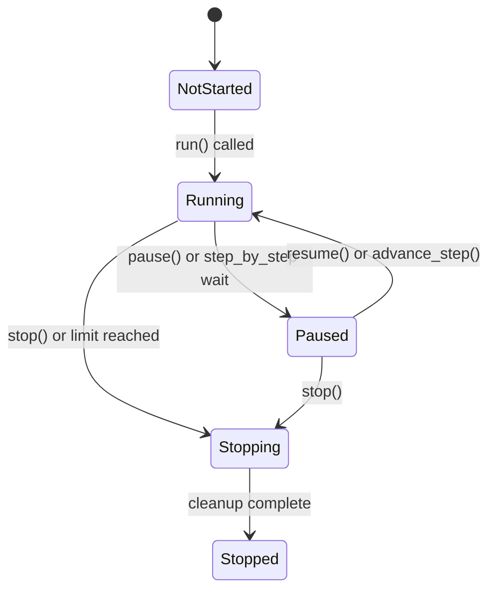

# Data Model: Crawl Stability & Observability Fixes

**Branch**: `024-crawl-stability-fixes` | **Date**: 2026-01-15

## Overview

This feature is primarily bug fixes and doesn't require significant data model changes. This document describes the minimal additions needed to support OCR statistics.

---

## Existing Entities (No Changes)

### CrawlStateMachine
- States: `UNINITIALIZED`, `INITIALIZING`, `RUNNING`, `PAUSED_MANUAL`, `PAUSED_STEP`, `STOPPING`, `STOPPED`, `ERROR`
- No changes required

### Run
- Existing fields cover crawl metadata
- OCR stats can be added to existing statistics structure

### StepLog
- Existing fields cover step-level data
- No changes required

---

## Extended Entities

### CrawlerLoop (Runtime State)

**New Fields for Timer Tracking**:

| Field | Type | Description |
|-------|------|-------------|
| `_paused_duration` | `float` | Cumulative time spent paused (seconds) |
| `_pause_start_time` | `Optional[float]` | Timestamp when pause started, None if not paused |
| `_ocr_total_time` | `float` | Cumulative OCR processing time (seconds) |
| `_ocr_operation_count` | `int` | Number of OCR operations performed |

**Computed Properties**:

| Property | Calculation |
|----------|-------------|
| `elapsed_running_time` | `time.time() - start_time - _paused_duration` |
| `ocr_avg_time_ms` | `(_ocr_total_time / _ocr_operation_count) * 1000` if count > 0, else 0 |

### Run Statistics Extension

The `on_crawl_completed` event and run export can include:

```python
completion_stats = {
    # Existing stats
    "total_steps": int,
    "unique_screens": int,
    "total_duration_ms": float,
    "completion_reason": str,
    
    # New OCR stats
    "ocr_avg_time_ms": Optional[float],
    "ocr_total_operations": Optional[int],
    
    # Recovery stats (already tracked)
    "total_recovery_count": int,
    "total_recovery_time_ms": float,
}
```

---

## Configuration Model Changes

### New Config Keys

| Key | Type | Default | Description |
|-----|------|---------|-------------|
| `mobsf_request_timeout` | `int` | `300` | HTTP request timeout for MobSF API calls (seconds) |

### Existing Config Keys (Verified Defaults)

| Key | Type | Default | Notes |
|-----|------|---------|-------|
| `mobsf_scan_timeout` | `int` | `900` | Total wait time for scan completion (seconds) |
| `mobsf_poll_interval` | `float` | `2` | Polling interval during scan wait |
| `pcapdroid_init_wait` | `float` | `3.0` | Wait time after starting capture |
| `pcapdroid_finalize_wait` | `float` | `2.0` | Wait time after stopping capture |

---

## Event Model Updates

### on_crawl_completed Event

**Current Signature**:
```python
on_crawl_completed(run_id: int, total_steps: int, total_duration_ms: float, reason: str)
```

**Extended Data** (passed via event payload):
```python
{
    "ocr_avg_time_ms": float,  # Average OCR operation time
    "ocr_total_operations": int,  # Number of OCR operations
}
```

Note: Event signature unchanged; extended data passed through existing `extra_data` parameter.

---

## State Transitions

### Timer State Machine



**Timer Behavior by State**:
| State | Timer Behavior |
|-------|---------------|
| Running | Elapsed time incrementing |
| Paused | Elapsed time frozen |
| Stopping | Elapsed time frozen (final value recorded) |

---

## No Database Schema Changes

This feature doesn't require database migrations. OCR statistics are:
1. Exposed via event system for UI display
2. Included in JSON export for persistence
3. Not stored in SQLite database tables

If persistent storage is needed later, the `runs` table could be extended with:
```sql
ALTER TABLE runs ADD COLUMN ocr_avg_time_ms REAL;
ALTER TABLE runs ADD COLUMN ocr_total_operations INTEGER;
```

But this is out of scope for this feature.
